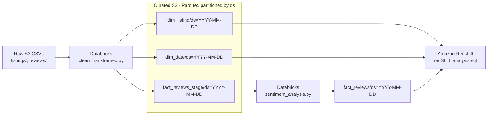

Airbnb Reviews Analytics (Databricks + Airflow + Redshift + LLM Sentiment)
==========================================================================

A compact, production-style project that ingests raw Airbnb data, cleans & curates it with **PySpark on Databricks**, enriches reviews with **LLM sentiment**, lands analytics tables in **Amazon Redshift**, and automates the whole flow with **Apache Airflow**.

🧭 Architecture & Flow
-------------------

## Data Pipeline Flow



*   **Airflow** orchestrates the two Databricks steps (clean → sentiment) per **run\_ds** (date) and optional sampling knobs.
    
*   **Curated outputs** are **Parquet partitions** in S3 (one directory per day).
    
*   **Redshift** script recreates the schema, **COPY**\-loads the selected day, runs **data-quality checks**, and executes **portfolio analyses**.


Data Source
-----------

This project uses public datasets from [**Inside Airbnb**](https://insideairbnb.com/).

*   **Snapshot:** September 2024
    
*   **Geography:** United Kingdom (GB)
    
*   **Files used:** listings.csv and reviews.csv
    
*   **What they contain:**
    
    *   listings.csv — listing attributes (host, location, property/room type, price, amenities, review scores, etc.)
        
    *   reviews.csv — one row per review (listing\_id, date, reviewer fields, free-text comments)
        
*   **How I staged them:** downloaded from Inside Airbnb and uploaded to S3 unders3://airbnb-bucket-data/raw/listings/ and s3://airbnb-bucket-data/raw/reviews/ (CSV; gzip accepted).
    
*   **Attribution & use:** Data is provided by Inside Airbnb for research/analysis. Please review their site for current terms and attribution requirements.
    

📁 Repository Layout
-----------------

```text
├── dag/
│   ├── airbnb_databricks_dag.py        # Airflow DAG: clean ➜ sentiment
│   └── airflow_dag_screenshot.png      # Screenshot of Airflow DAG
├── docker-compose.yml                   # Minimal Airflow + Postgres (dev)
├── clean_transformed.py                 # Databricks: curate raw CSVs → Parquet
├── sentiment_analysis.py                # Databricks: LLM sentiment
├── README.md
├── data/
│   ├── listings.csv        
│   └── reviews.csv      
├── redShift_analysis.sql                # DDL + COPY + DQ checks + analysis portfolio
└── airbnb_exploratory_analysis.ipynb   
```

What each piece does 
----------------------------------

### clean\_transformed.py (Databricks)

  *   Reads **raw/listings/** & **raw/reviews/** CSVs from S3 with robust options for messy data.
      
  *   Normalizes schema (lowercases, trims, casts IDs to strings).
      
  *   Engineers features (e.g., **price\_bucket**, **amenities\_count**, boolean parsing).
      
  *   Writes three partitioned tables under **curated/** **for one day** (ds=YYYY-MM-DD):
      
      *   **dim\_listing** – one clean row per listing.
          
      *   **dim\_date** – calendar rows from actual review dates.
          
      *   **fact\_reviews\_stage** – one row per review with comments and tokens\_ct (for LLM cost control).
          
  *   Idempotent per-day write: each run **overwrites exactly one ds partition**.
      


<br><br>

### sentiment\_analysis.py (Databricks) — **what it actually does**

  *   **Purpose:** read **curated/fact\_reviews\_stage/ds={RUN\_DS}**, score comment sentiment with OpenAI, write **curated/fact\_reviews/ds={RUN\_DS}**.
      
  *   **Safety & fallback:**
      
      *   Resolves RUN\_DS from a Databricks widget or environment; if the requested partition is missing, it **falls back to the latest available day** under fact\_reviews\_stage/.
          
      *   If no comments after filters, it exits cleanly (no error).
          
  *   **Cost/latency control (widgets/env):**
      
      *   MAX\_ROWS (hard cap), SAMPLE\_FRAC (0..1), MAX\_TOKENS (skip long comments), SEED (deterministic shuffling).
          
  *   **LLM call:**
      
      *   Batches small groups (BATCH\_SIZE) with sleep (SLEEP\_SEC) to avoid rate spikes.
          
      *   Sends a strict **JSON-only** instruction; parses the result; if parsing fails or counts mismatch, returns conservative defaults.
          
      *   Produces sentiment\_label ∈ {POSITIVE, NEGATIVE} and sentiment\_score ∈ \[0,1\].
          
  *   **Secrets & robustness:**
      
      *   API key from OPENAI\_API\_KEY env var; if absent, reads a Databricks Secret (scope=openai, key=OPENAI\_API\_KEY).
          
      *   Clear logging of which partition is read/written.
          
  *   **Output:**
      
      *   Writes **fact\_reviews/ds=YYYY-MM-DD** with columns_(review\_id, listing\_id, date\_key, comments, tokens\_ct, sentiment\_label, sentiment\_score, ds)_.
        

<br><br>

### airbnb\_databricks\_dag.py (Airflow)

  *   Two Databricks tasks, **linear DAG**: clean\_transformed → sentiment\_analysis.
      
  *   run\_ds defaults to Airflow’s {{ ds }}; you can override in the **Trigger** dialog.
      
  *   Passes sampling knobs to sentiment so you can throttle cost/time **without code changes**.
      
  *   Uses **Airflow Variables** for Databricks connection, cluster id, and notebook paths.


<br><br>

### redShift\_analysis.sql (Warehouse)

  *   Creates **airbnb** schema and three tables: dim\_listing, dim\_date, fact\_reviews.
      
  *   **COPY**\-loads from the curated **ds** partition you choose (single-day snapshot).
      
  *   **Data-quality gates:** row counts, null keys, duplicate PKs, referential integrity, out-of-range values.
      
  *   **Analysis portfolio:** supply mix, price landscape (avg/median/p90), sentiment by city, value picks, availability signals, best/worst sentiment listings, etc.
      
  *   **Reusable views** (e.g., vw\_listing\_sentiment, vw\_city\_sentiment\_daily) for BI dashboards.

    

How to run 
------------------------

## 1) Bring up Airflow locally (dev only)
```bash
docker compose up -d
# UI at http://localhost:8080 (admin/admin) 
```

## 2) Trigger a run for a given day
**UI:**  
Trigger DAG → “Configure” → paste JSON:

```json
{
  "run_ds": "2025-08-25",
  "max_rows": 1500,
  "sample_frac": 0.10,
  "max_tokens": 80,
  "seed": 42
}
```

**CLI:**

```bash
airflow dags trigger -c '{"run_ds":"2025-08-25"}' airbnb_databricks
```

### 3) Publish to Redshift

*   Open redShift\_analysis.sql, replace :DS\_DAY and the IAM role ARN, then run:
    
    *   DDLs → COPY loads → DQ checks → analysis queries.
        

Design choices 
----------------------------------------

*   **Idempotent per-day writes**: small blast radius, simple reruns, easy backfills.
    
*   **Explicit sampling** on LLM: control spend/latency; reproducible with SEED.
    
*   **Strict JSON contract** with the model: deterministic parsing, safe defaults on failure.
    
*   **Warehouse-ready** star-ish model: easy joins, fast aggregation, BI-friendly views.
    
*   **Separation of concerns**: curation vs. enrichment vs. publishing vs. analytics.
    

    
